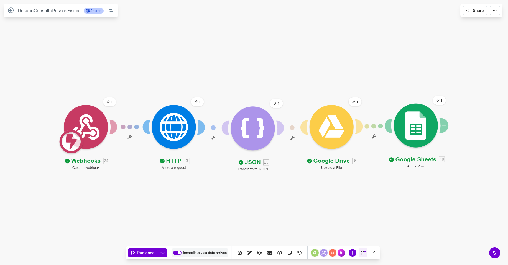
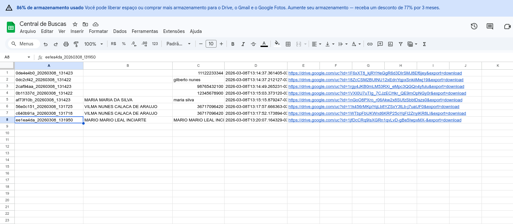
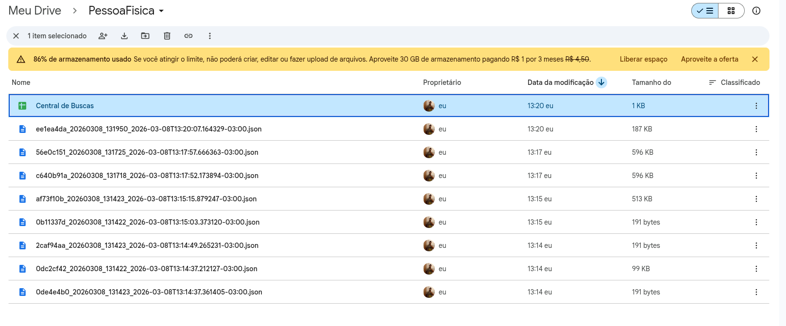

# Solução desenvolvida pra Desafio Tecnico: "Desafio Full Stack Developer - Python (RPA e Hiperautomação)"

## Detalhes do projeto

Esse codigo visa criar uma api para realizar um scraper no portal da transparencia do governo
na area de consulta a pessoas fisica e a partir dessa api, usar o Make para criar um arquivo json no
google drive e alimentar uma planilha central do google sheets

### 📸 Demonstração da Solução

**Links de acesso**
Webhook: https://us2.make.com/public/shared-scenario/sFc2NuHq7qi/desafio-consulta-pessoa-fisica
API: https://desafioconsultapessoafisica.up.railway.app/consulta/
Drive: https://drive.google.com/drive/folders/1AS-T9UWNbLL-bGzOtUGxTLps1lKOfSxJ?usp=drive_link

#### Fluxo de Automação no Make.com



#### Dados Consolidados no Google Sheets



#### Arquivos JSON armazenados no Google Drive



### Tecnologias utilizadas

- Python
- FastAPI
- Playwrigth(scraper)
- Make(automação de requisições e integração com google)
- Docker
- Railway(deploy em conjunto com docker)
- asyncio
- base64
- uuid
- pytz

# Arquitetura e Fluxo de dados

1. **FastAPI**: expões o endpoint 'consulta/{termo}' que pode receber CPF, Nis ou nome e retorna um json estruturado
   contendo id de consulta, data da consulta, termo de busca e resultados ou mensagem de aviso.
2. **Playwrigth**: responsavel por navegar até o portal, buscar os dados e capturar screenshots.
3. **Make**:

- webhook recebe um json no formato '{"termo": "termo"}' como gatilho
- começa o fluxo enviando a requisição HTTP GET para o endpoint da api
- utiliza o retorno da api para gerar um arquivo .json no google drive
- utiliza o arquivo do drive para preencher o sheets com a seguinte estrutura:

        |id|Nome encontrado|termo de busca|data e hora|link para download do arquivo json

## 💡 Decisões Técnicas e Otimizações

- **Tecnologias**: Decidi usar tecnologias recomendadas(Python, Playwrigth, Make) para alinhar totalmente com o escopo do desafio
- **Gerenciamento de Contexto**: no começo estava abrindo um browser de cada vez, mas isso acabava por consumir muita memoria ram,
  então preferi abrir apenas um browser junto com o servidor pelo FastAPI e gerenciar os contextos pelo scraper, oque melhorou muito
  o desempenho
- **Extração De detalhes**: processamento das abas de forma sequencial, evita abrir muitas abas e otimiza o consumo de memoria.
- **Tratamento anti-bot**: tive um problema ao utiliza o playwrigth em modo headless, aparentemente algum bloqueio ou falta de
  otimização do site, oque resolveu foi configurar o contexto do browser e setar o webdriver como undefined, além de deixar a resolução do navegador em 1920x1080

## 📡 Documentação da API

### `GET /consulta/{termo}`

Realiza a busca completa de um beneficiário.

**Exemplo de Resposta:**

```json
{
  "consulta_id": "a1b2c3d4_20231027",
  "termo_busca": "NOME DO BENEFICIARIO",
  "data_consulta": "2023-10-27T10:00:00-03:00",
  "resultados": {
    "imagem_resultado": "iVBORw0KGgoAAA...",
    "resultados": [
       {
         "beneficio": "AUXILIO BRASIL",
         "nis": "123.456.789-00",
         "valor": "R$ 600,00",
         "detalhes": [...]
       }
    ]
  }
}
```
